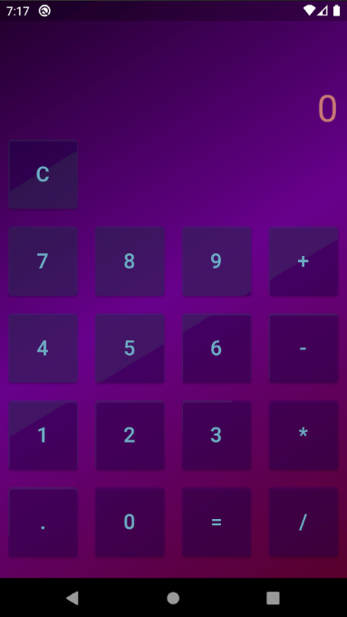
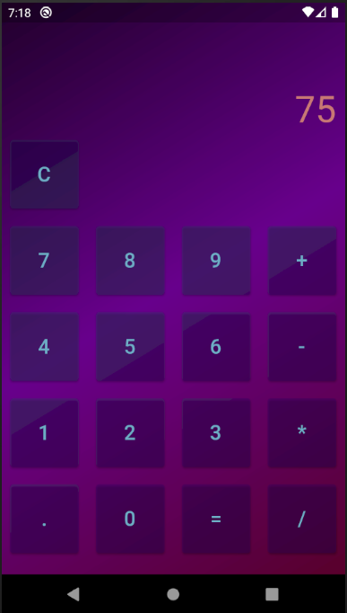

<h1 align="center">
 
Calculator Flutter
</h1>

 

A simple calculator with Flutter

## Screenshots

  
  

## Features
This app features all the latest tools and practices in mobile development!

- **Modular** — A smart project structure.
- **Slidy** — CLI package manager and template for Flutter
